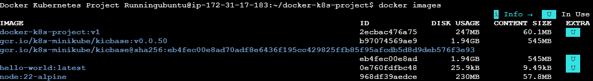
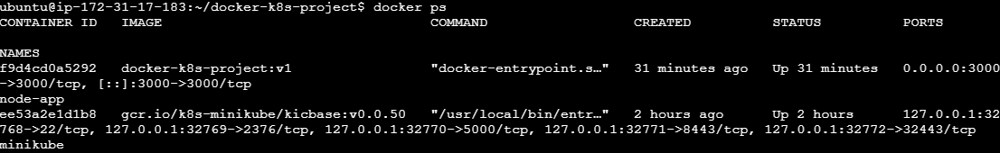
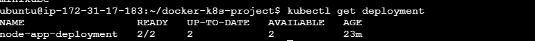
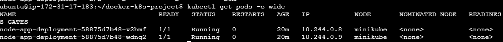
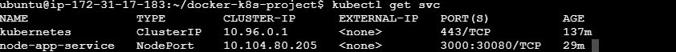
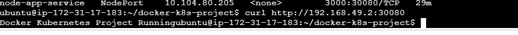

# Docker & Kubernetes Node.js Deployment on AWS

## Project Overview

This project demonstrates containerizing a Node.js application using Docker and deploying it on Kubernetes (Minikube) running on AWS EC2.

## Technologies Used

- AWS EC2
- Ubuntu Linux
- Docker
- Kubernetes (Minikube)
- Node.js
- GitHub

## Architecture

User
↓
NodePort Service
↓
Kubernetes Deployment
↓
Pods (2 Replicas)
↓
Docker Container
↓
Node.js Application

## Docker Commands

```bash
docker build -t docker-k8s-project:v1 .
docker run -d --name node-app -p 3000:3000 docker-k8s-project:v1
```

## Troubleshooting Performed

- Resolved Kubernetes ErrImageNeverPull issue
- Expanded AWS EBS volume from 8 GB to 20 GB
- Resized Linux filesystem using growpart and resize2fs
- Recovered broken apt/dpkg package installation
- Debugged Docker container networking and port conflicts

## Screenshots

### Docker Images


### Running Docker Container


### Kubernetes Deployment


### Kubernetes Pods


### Kubernetes Service


### Application Output

